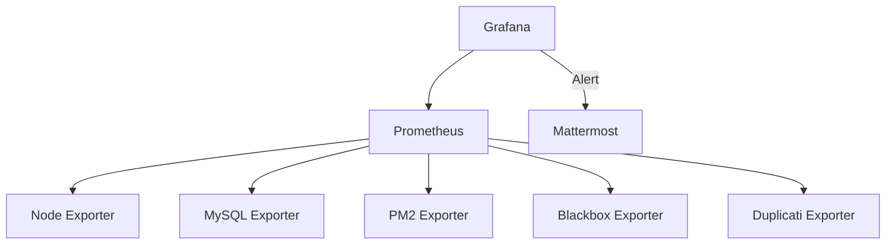
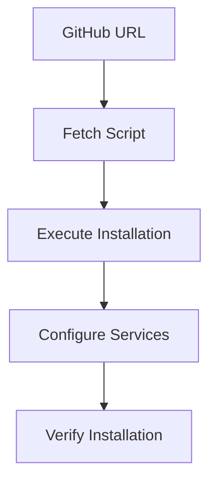
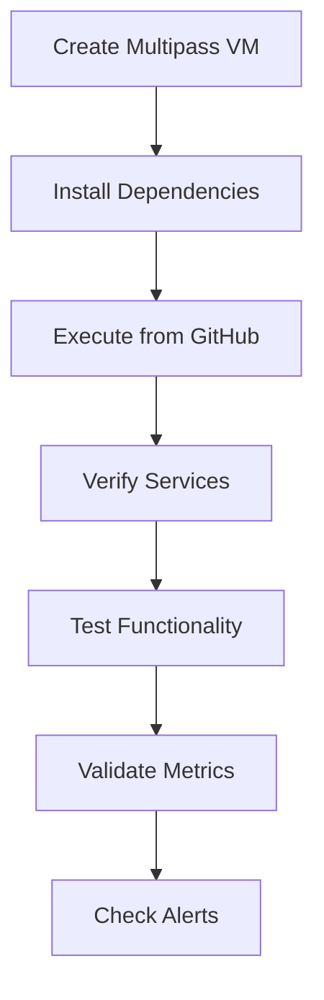

# System Patterns

## Architecture Overview

### 1. Component Architecture


### 2. Data Flow


## Technical Patterns

### 1. Installation Pattern
- Direct installation from GitHub URL
- Package manager-based installation (apt/yum)
- Fallback to binary installation when needed
- Systematic dependency management
- Service user creation for security
- Environment variable configuration
- Manual testing in Multipass environment

### 2. Configuration Management
- Single source of truth for configurations
- Version-controlled configuration files
- Template-based provisioning
- Centralized alert rules
- Idempotent updates

### 3. Service Management
- Systemd service definitions
- Automatic service registration
- Controlled restart mechanisms
- Status monitoring
- Environment file support

## Component Relationships

### 1. Prometheus Integration
- Central metrics collection
- Configurable scrape intervals
- Job-based target configuration
- Label-based metric organization
- Rule-based alerting

### 2. Exporter Implementation
- **Node Exporter**
  - System metrics collection
  - Hardware monitoring
  - Resource utilization tracking

- **MySQL Exporter**
  - Database performance metrics
  - Connection monitoring
  - Query performance tracking

- **PM2 Exporter**
  - Process status monitoring
  - Resource usage tracking
  - Application health checks

- **Blackbox Exporter**
  - SSL certificate monitoring
  - Endpoint availability checks
  - Response time tracking
  - Enhanced probe configuration

- **Duplicati Exporter**
  - Backup status monitoring
  - Duration tracking
  - Size metrics collection
  - Custom scrape interval

### 3. Grafana Organization
- Provisioned datasources
- Pre-configured dashboards
- Structured alert rules
- Template variables
- Notification channels

### 4. Alert Integration
- Mattermost webhook integration
- Custom message templates
- Alert grouping
- Severity-based routing

## Design Decisions

### 1. Security
- Dedicated service users
- Minimal required permissions
- Secure default configurations
- Protected metric endpoints
- Secure webhook handling

### 2. Scalability
- Independent monitoring stacks
- Configurable retention periods (15d default)
- Optimized scrape intervals
- Efficient data storage
- Customizable per-job settings

### 3. Maintainability
- Unified configuration management
- Clear separation of concerns
- Documented installation steps
- Version-controlled templates
- Environment-based configuration

### 4. Reliability
- Service auto-recovery
- Persistent configurations
- Backup monitoring
- Error handling
- Alert notification

## Implementation Standards

### 1. Installation Methods


### 2. Manual Testing Flow


### 3. File Organization
```
/etc/
├── grafana/
│   ├── provisioning/
│   │   ├── datasources/
│   │   ├── dashboards/
│   │   ├── alerting/
│   │   └── notifiers/
├── prometheus/
│   ├── prometheus.yml
│   └── rules/
└── exporters/
    ├── node_exporter/
    ├── mysql_exporter/
    ├── blackbox_exporter/
    ├── pm2_exporter/
    └── duplicati_exporter/
```

### 2. Configuration Standards
- YAML for service configuration
- JSON for dashboard definitions
- Systemd unit files for services
- Environment files for credentials
- Unified configuration sources

### 3. Monitoring Standards
- Standard metric naming
- Consistent label usage
- Common alert thresholds
- Unified dashboard layouts
- Custom scrape intervals where needed

### 4. Alert Organization
- Severity-based classification
- Clear alert descriptions
- Actionable alert messages
- Appropriate timing thresholds
- Standardized message templates
